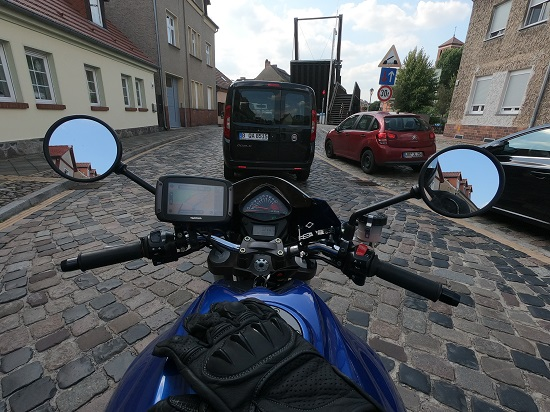

My Name is Maximilian, most of my time is spent on my favourite topic - technology.
I work as a product owner, developer, manager, mostly on the Fintech SaaS industry.

Besides the passion for technology, I like taking photos of everyday things - check out my photography page: 

[23ro.photography](https://23ro.photography/) and find me on 

and spend time on my two wheeled toys: a Cagiva Raptor 650 IE (2006) & a Cagive Mito Evo (2001).

Feel free to check my [Youtube Channel](https://www.youtube.com/c/MaximilianNebl) and subscribe.

